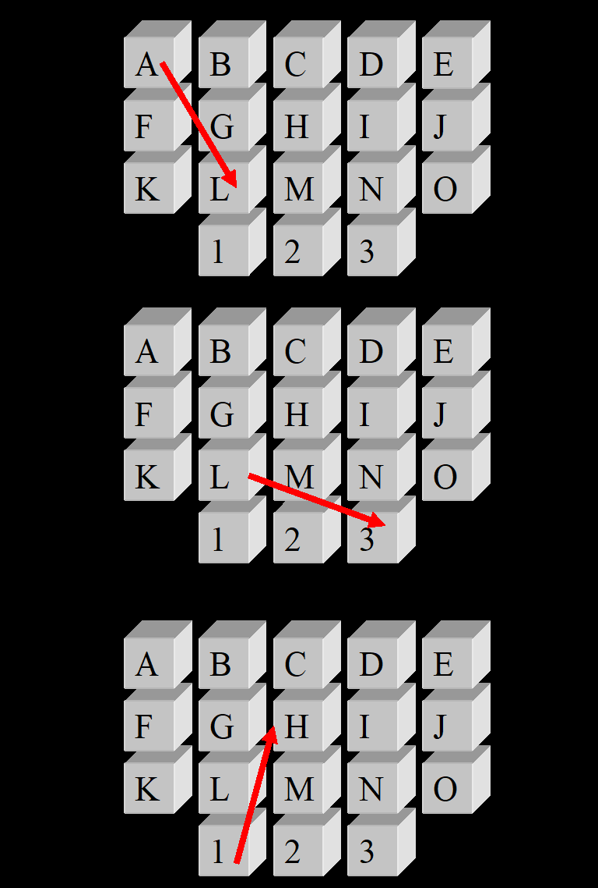

Knight Sequences

Pictured below is a keypad:

We want to find all 10-key sequences that can be keyed into the keypad in the following manner:
* The initial keypress can be any of the keys.
* Each subsequent keypress must be a knight move from the previous keypress.  
* There can be at most 2 vowels in the sequence.
* We will attempt to run your solution at lengths of 10, 16 and 32.

A knight move is made in one of the following ways:
1.	Move two steps horizontally and one step vertically.
2.	Move two steps vertically and one step horizontally.
      There is no wrapping allowed on a knight move.
      Below are some examples of knight moves:

Your program should first write the number of valid 10-key sequences on a single line to standard out.

1. In a command line window, change to directory %ZIP_ROOT%/classes/production/knights-sequence
2. Run "java com.knights.sequence.Main option1 option2" (where option1 and option2 are described below). Example: "java com.knights.sequence.Main 2 32"
3. option1 (type) -- 1=without hash code implementation (see 5 below), 2=with hash code implementation (see 6 below)
4. option2 (input) -- number of sequences
5. Path.class does not implement 'public int hashCode().' HashMap used for memoization therefore 
   has a lot of collisions in its hash table. Hash table bucket list is printed at the end that
   shows the number of collisions is very high and, hence, causes this option to throw an
   OutOfMemory excetion with inputs of 10-13. Bucket list printed with the help of class described 
   below in footnote.
6. HashPath.class implements 'public int hashCode().' Hash table bucket list is printed at the end that
   shows the number of collisions is very low and, hence, this is the recommended option to use for the solution.
   Bucket list printed with the help of class described below in footnote.
7. Java 7-8 lambdas were avoided to be compatible with jdk 1.5+, but a jdk 1.8 is recommended.   
8. This can also be run as an IntelliJ project. You will proably have to configure the project to point to your
   local jdk.

Footnote: Hash table bucket list printed with the class MapClashInspector.class found here: http://www.javaspecialists.eu/archive/Issue235.html

Anthony Browne